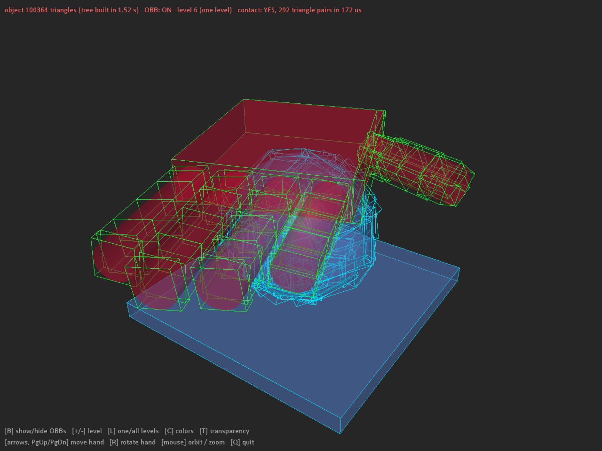
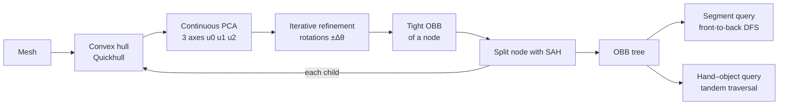
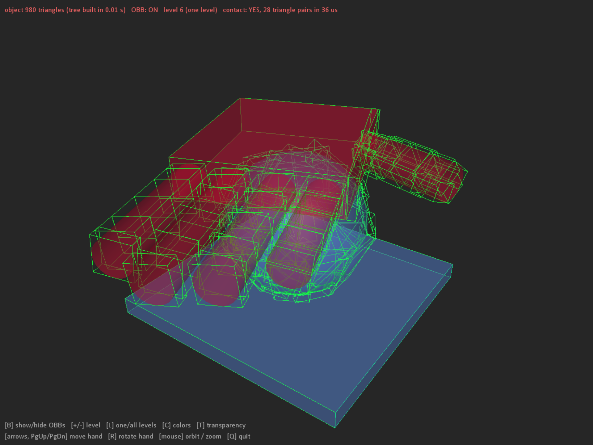
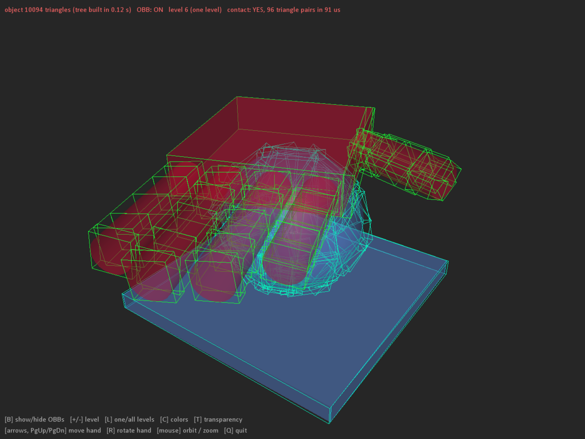
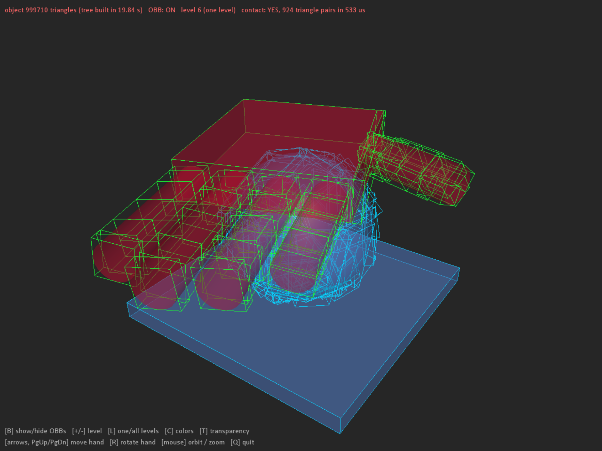
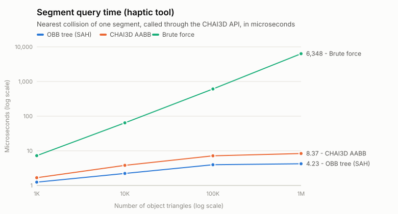
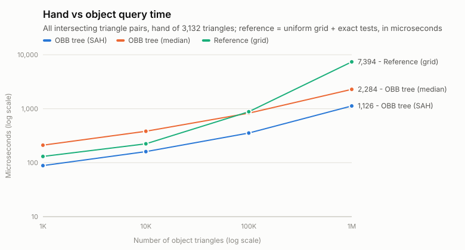
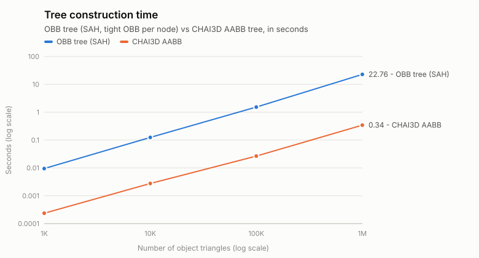

# OBB Tree for CHAI3D: hand–object collision detection

A collision detection library built on an **OBB (Oriented Bounding Box) tree**, integrated into [CHAI3D](https://www.chai3d.org) without modifying CHAI3D's source. Every node of the tree is a tight OBB computed from the **convex hull**, **continuous PCA** and **iterative refinement**. The tree is built with the **Surface Area Heuristic (SAH)** and answers two kinds of queries:

- **segment vs mesh**: CHAI3D haptic tools, through `cGenericCollision`;
- **mesh vs mesh**: the intersecting triangle pairs between a human hand and an object.

<p align="center">
  
</p>

---

## Contents

1. [Repository layout](#repository-layout)
2. [Build and run](#build-and-run)
3. [Usage](#usage)
4. [Algorithm](#algorithm)
5. [Experimental results](#experimental-results)
6. [Limitations and future work](#limitations-and-future-work)
7. [Tests](#tests)
8. [References](#references)

---

## Repository layout

```
OBB_alg/
├── CMakeLists.txt                 builds CHAI3D + the OBB library
├── chai3d-master/chai3d-master/   original CHAI3D (unmodified)
├── Algorithm/
│   ├── src/
│   │   ├── CCollisionOBBBox.h         OBB structure (10 floats)
│   │   ├── CConvexHull.*              3D convex hull (Quickhull)
│   │   ├── CCollisionOBBFit.*         continuous PCA, OBB fitting
│   │   ├── CCollisionOBBRefine.*      iterative refinement (local search)
│   │   ├── CCollisionOBBTree.*        BVH + SAH, queries
│   │   ├── CCollisionOBBIntersect.*   box–box SAT, triangle–triangle, ...
│   │   ├── CCollisionOBB.*            collision detector for cMesh
│   │   └── CCollisionOBBDraw.*        OpenGL wireframe drawing of OBBs
│   ├── tests/                     7 test programs (ctest)
│   └── examples/
│       ├── obb_viewer/            interactive viewer (GLFW)
│       └── obb_benchmark/         benchmark, 1K → 1M triangles
└── docs/
    ├── benchmark_results.csv      measured data
    ├── make_charts.py             builds the SVG charts from the data
    └── images/                    images used in this README
```

## Build and run

Requirements: Windows, MSVC (Visual Studio 2022/2026), CMake ≥ 3.19. Tested with MSVC 19.51 and CMake 4.4.

```bash
cmake -S . -B build -G "Visual Studio 18 2026" -A x64
cmake --build build --config Release

ctest --test-dir build -C Release                        # 7 test suites
build/Algorithm/Release/obb_viewer.exe                    # interactive viewer
build/Algorithm/Release/obb_benchmark.exe results.csv     # benchmark
```

`obb_viewer` keys: **B** show/hide the OBBs, **+ / −** change the displayed level, **L** one level or all levels, **C** color by level, **T** transparent meshes on/off, **arrows / PgUp / PgDn / R** move and rotate the hand, **mouse drag** orbit the camera.
Command-line options: `--triangles N`, `--level N`, `--hand x y z`, `--screenshot file.png`.

## Usage

```cpp
#include "chai3d.h"
#include "CCollisionOBB.h"

// build the OBB tree (SAH) and attach it to the mesh, replacing the default AABB detector
cCreateOBBCollisionDetector(object);
cCreateOBBCollisionDetector(hand);

// display
object->setShowCollisionDetector(true);

// in the haptic loop, after world->computeGlobalPositions(true):
bool contact = cComputeMeshIntersection(hand, object);          // stops at the first contact
std::vector<cOBBTrianglePair> pairs;
cComputeMeshIntersection(hand, object, &pairs);                  // all intersecting triangle pairs
```

CHAI3D's built-in haptic tools (`cToolCursor`, finger-proxy) use the OBB tree as soon as it is attached to the mesh.

---

## Algorithm



### 1. OBB declaration: `cCollisionOBBBox`

An OBB takes exactly **10 floats (40 bytes)**: center (3), half-extents (3) and orientation as a quaternion `(x, y, z, w)` (4). The class deliberately has no virtual functions so that node arrays stay compact in memory; a `static_assert` guarantees the 40-byte size. When an OBB is fitted, the half-extents are **rounded up** to the next float, so the box always contains every point even though it is stored in float precision.

### 2. Finding the minimum (tight) OBB

1. **Convex hull (Quickhull).** Only the points on the convex hull are kept. Interior vertices and the extra vertices of finely tessellated flat regions are removed.
2. **Continuous PCA** (Gottschalk – RAPID). Each triangle is weighted by its area $A^i$, not by its number of vertices, so the result is not biased by the tessellation:

   $$\mu = \frac{1}{A_H}\sum_i A^i \mathbf{c}^i, \qquad
   C_{jk} = \frac{1}{A_H}\sum_i \frac{A^i}{12}\left(9c^i_j c^i_k + p^i_j p^i_k + q^i_j q^i_k + r^i_j r^i_k\right) - \mu_j\mu_k$$

   The three eigenvectors of $\mathbf{C}$ are the three axes $\mathbf{u}_0, \mathbf{u}_1, \mathbf{u}_2$ of the OBB.
3. **Iterative refinement** (local search). The frame is rotated about each axis $\mathbf{u}_k$ by $\pm\Delta\theta$ (5°, then 1° by default); the hull vertices are projected onto the new axes to compute the volume, and a rotation is kept when it reduces the volume. At most 5 iterations.
4. **Extents.** **All** input points are projected onto the three axes to obtain the size of the box.

> Example: a 4×1 rectangle, one half of which is split into 4,096 triangles. Vertex-based PCA puts the centroid off by 0.685 and tilts the major axis by 7.4°. Continuous PCA gives an error of 3·10⁻¹⁴ and a tilt of 0°.

### 3. Building the tree with SAH

At each node, the algorithm sweeps **all N − 1 split planes** along the three OBB axes of the node (triangles sorted by centroid) and picks the plane with the lowest cost:

$$Cost = C_{node} + \frac{S_L}{S_P}N_L + \frac{S_R}{S_P}N_R$$

A node becomes a leaf when no split is cheaper than testing all of its triangles ($Cost \ge N$).

| BVH design principle | How it is met |
|---|---|
| Triangles in a subtree are close to each other | Splits follow the centroid order along an OBB axis |
| Each node has minimal volume | Tight OBB: convex hull + continuous PCA + refinement |
| Minimal total volume and sibling overlap | SAH minimizes surface area; at 18K triangles, 5% overlap vs 21% with median splits |
| More attention to nodes near the root | The first 4 levels get finer refinement (10 iterations, steps of 15/5/1/0.2°) |
| Balanced tree | Each child receives at least 10% of its parent's triangles, so the depth is O(log N) |

### 4. Finding intersections

- **Segment** (haptic tool): DFS with an explicit stack. The nearer child is visited first, and branches farther than the best hit found so far are skipped (branch and bound). Segment–OBB uses the slab test; segment–triangle uses Möller–Trumbore.
- **Hand – object**: **tandem traversal** of the two trees. Each pair of nodes is tested with the **15-axis SAT** (OBB–OBB); separated pairs are pruned, otherwise the node with the larger box is split. At leaf pairs, triangles are tested with a triangle–triangle SAT. The *first contact* mode stops at the first intersecting triangle pair.

---

## Experimental results

**Test machine.** AMD Ryzen AI 9 HX 370, 31 GB RAM, Windows 11, MSVC 19.51 Release, single thread.
**Object:** a ball of radius 4 cm, tessellated with 1K to 1M triangles, resting on a 14 × 14 cm plate.
**Hand:** a palm and five fingers, **3,132 triangles**.
**Queries:** 1,000 random segments; 200 random hand poses, about 87% of which are in contact.

### The algorithm at 4 mesh sizes

Same view and same displayed level (6). The hand turns red on contact. The status bar shows the tree construction time, the number of intersecting triangle pairs and the query time measured in that frame.

| 1,000 triangles | 10,000 triangles |
|:---:|:---:|
|  |  |
| **100,000 triangles** | **1,000,000 triangles** |
|  |  |

### Timing

<p align="center"></p>
<p align="center"></p>
<p align="center"></p>

**Segment queries** (µs per query):

| Triangles | OBB tree, direct call | OBB tree, CHAI3D API | CHAI3D AABB | Brute force | Box + triangle tests (SAH) |
|---:|---:|---:|---:|---:|---:|
| 980 | 0.68 | 1.25 | 1.67 | 7.2 | 10.7 + 1.6 |
| 10,094 | 0.99 | 2.22 | 3.81 | 64.1 | 13.8 + 1.5 |
| 100,364 | 1.29 | 3.97 | 7.16 | 609 | 15.8 + 1.6 |
| 999,710 | 1.34 | 4.23 | 8.37 | 6,348 | 17.4 + 1.5 |

**Hand – object** (µs per query):

| Triangles | First contact | All pairs (SAH) | All pairs (median) | Reference (grid) | Mean pairs | Box + triangle tests |
|---:|---:|---:|---:|---:|---:|---:|
| 980 | 2.8 | 88.5 | 211 | 131 | 198 | 875 + 804 |
| 10,094 | 3.6 | 161 | 383 | 224 | 340 | 1,668 + 1,057 |
| 100,364 | 5.9 | 354 | 828 | 879 | 757 | 3,091 + 1,911 |
| 999,710 | 9.2 | 1,126 | 2,284 | 7,394 | 2,276 | 7,943 + 5,163 |

**Construction and memory:**

| Triangles | OBB tree (SAH) | CHAI3D AABB | Nodes / depth | SAH cost: SAH / median | Memory: OBB / AABB |
|---:|---:|---:|---:|---:|---:|
| 980 | 0.009 s | 0.0002 s | 1,039 / 13 | 13.0 / 44.8 | 0.09 / 0.24 MB |
| 10,094 | 0.12 s | 0.003 s | 11,125 / 18 | 16.3 / 62.3 | 0.95 / 2.46 MB |
| 100,364 | 1.53 s | 0.027 s | 106,597 / 24 | 17.9 / 82.3 | 9.2 / 24.5 MB |
| 999,710 | 22.8 s | 0.34 s | 1,068,621 / 28 | 20.1 / 88.8 | 91.7 / 244 MB |

The OBB tree memory includes its nodes, triangle indices and a copy of the mesh vertices. The AABB memory is estimated as (2N − 1) nodes × 128 bytes, counting the nodes only.

### Detection accuracy

Each method is compared with an exact reference:
- **Segments:** brute force over all triangles.
- **Hand – object:** a uniform grid plus exact triangle-pair tests. This reference uses **no OBB and no tree**.

Definitions:
- **Recall** = true collisions found / all true collisions.
- **Precision** = correct results / all reported results.

| Triangles | Segments, OBB tree (recall / precision) | Segments, CHAI3D API, both OBB and AABB (recall / precision) | Hand–object, triangle pairs (recall / precision) | Hand–object, contact yes/no |
|---:|---:|---:|---:|---:|
| 980 | 100% / 100% | 100% / 100% | 100% / 100% | 200/200 |
| 10,094 | 100% / 100% | 100% / 100% | 100% / 100% | 200/200 |
| 100,364 | 100% / 100% | 92.1% / 93.7% | 100% / 100% | 200/200 |
| 999,710 | 100% / 100% | 60.8% / 84.3% | 100% / 100% | 200/200 |

> **Why does the CHAI3D API path drop at 100K and 1M triangles?** At these sizes, the OBB detector and CHAI3D's own AABB detector give **identical results**: 0 differences over 1,000 segments. The cause is CHAI3D's `cIntersectionSegmentTriangle`: it discards triangles with $(2A)^2 < 10^{-13}$ (an absolute tolerance), i.e. triangles with edges shorter than about 0.6 mm. The OBB tree's direct query uses the scale-independent Möller–Trumbore test and is always 100% correct.

### Efficiency analysis

- **Query time grows almost as log N.** When the number of triangles grows 1,000 times, a segment query only goes from 0.68 to 1.34 µs, and the number of box tests from 10.7 to 17.4. At 1M triangles, a query is **4,700 times** faster than brute force with a direct call, and **1,500 times** faster through the CHAI3D API.
- **1.3 to 2 times faster than CHAI3D's AABB** through the same API, thanks to tighter OBBs and SAH. The OBB tree also takes **2.7 times less** memory, because each box is only 40 bytes and each leaf holds about 2 triangles.
- **SAH vs median split:** the SAH cost is 3.4 to 4.6 times lower, a segment query needs about 4 times fewer box tests, and hand–object queries are 2 to 2.4 times faster, while the construction time is comparable (at most 18% slower).
- **Hand – object:** the first-contact mode takes only **2.8 – 9.2 µs**, well within a 1 kHz haptic loop (1 ms) at every size. The all-pairs mode scales with the number of pairs found (198 to 2,276 pairs): 1.13 ms at 1M triangles, about 13,000 tests instead of 3.1·10⁹ brute-force tests.
- **The price is construction time:** 40 to 66 times slower than the AABB tree (22.8 s vs 0.34 s at 1M), because every node computes a convex hull, a PCA and a refinement. The tree is built only once, when the model is loaded.

## Limitations and future work

- **Deforming meshes:** the tree is built in the local frame, so it is only valid for rigid meshes. A hand should be modeled as separate rigid finger segments, one `cMesh` each.
- **`cMultiMesh`** (the usual format of hand models loaded from OBJ/3DS files) is not supported directly yet.
- **The CHAI3D narrow phase** misses triangles smaller than about 0.6 mm (see detection accuracy). It can be fixed with a scale-independent test when the tool radius is zero.
- **PCA with nearly equal eigenvalues** (symmetric objects such as a cube) gives arbitrary axes; the refinement is a local search and can stop in a local minimum.
- **Construction time** could be reduced with binned SAH or parallel construction.

## Tests

| Program | What it checks |
|---|---|
| `test_obb` | 40-byte OBB structure, quaternion order, `contains()` |
| `test_convex_hull` | Closedness, Euler formula, convexity; degenerate cases; 100,000 points in 0.17 s |
| `test_obb_fit` | Analytic covariance, tessellation invariance, 50 random poses |
| `test_obb_refine` | Refinement never makes a box worse; recovery of a perturbed frame; flat shapes |
| `test_obb_primitives` | More than 65,000 random configurations, against an independent formulation and CHAI3D's functions |
| `test_obb_tree` | Tree structure, brute force comparison, **0 differences** with `cCollisionAABB` |
| `test_obb_draw` | Wireframe corners and edges, level cut of the display |

Reproducing the data and charts:

```bash
build/Algorithm/Release/obb_benchmark.exe docs/benchmark_results.csv
python docs/make_charts.py docs/benchmark_results.csv docs/images
```

## References

- S. Gottschalk, M. C. Lin, D. Manocha. *OBBTree: A Hierarchical Structure for Rapid Interference Detection.* SIGGRAPH 1996.
- C. Ericson. *Real-Time Collision Detection.* Morgan Kaufmann, 2005 (chapters 4 and 6).
- C. B. Barber, D. P. Dobkin, H. Huhdanpaa. *The Quickhull Algorithm for Convex Hulls.* ACM TOMS, 1996.
- J. D. MacDonald, K. S. Booth. *Heuristics for Ray Tracing Using Space Subdivision.* The Visual Computer, 1990.
- T. Möller, B. Trumbore. *Fast, Minimum Storage Ray/Triangle Intersection.* Journal of Graphics Tools, 1997.
- F. Conti et al. *CHAI3D: an open-source library for the rapid development of haptic scenes.* [www.chai3d.org](https://www.chai3d.org)
